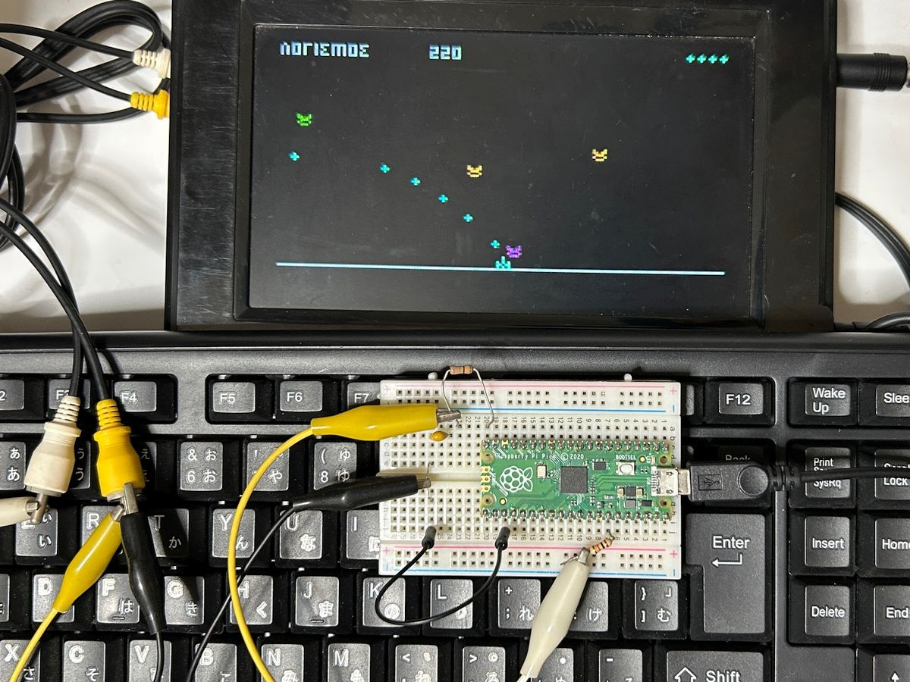
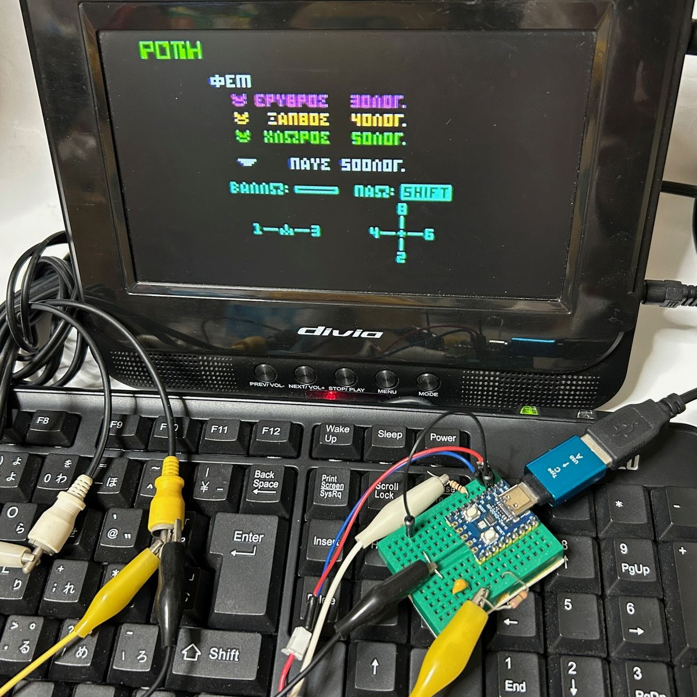
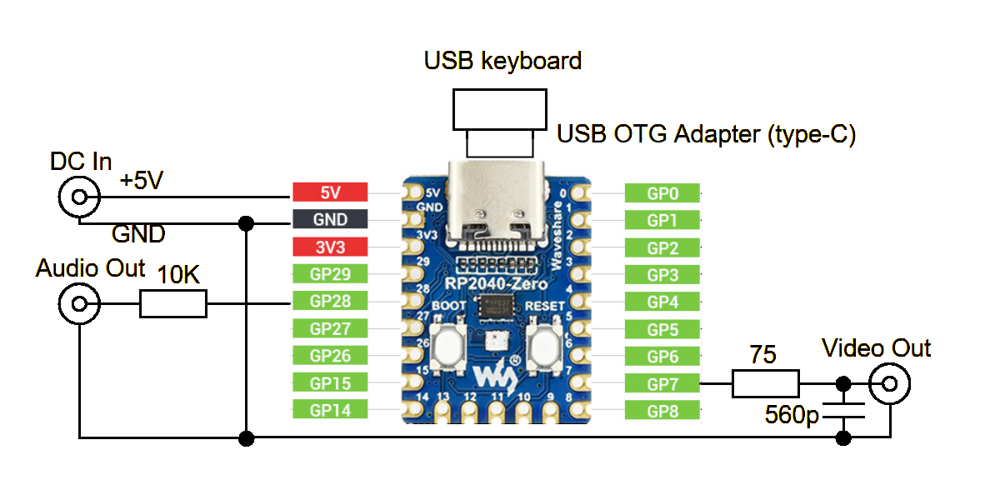
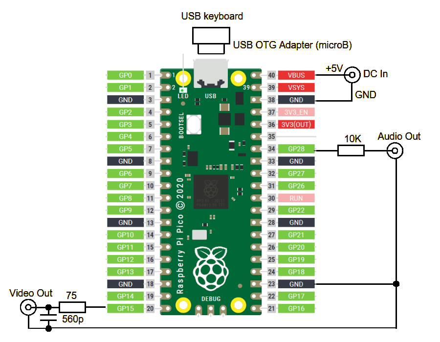
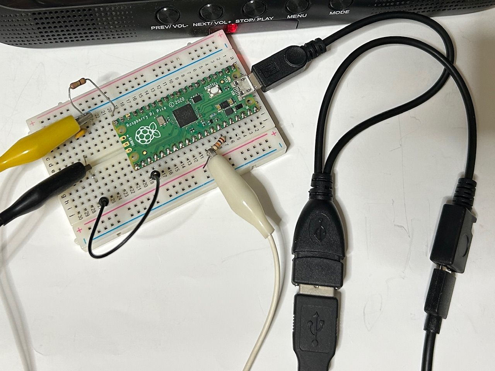

# ΡΟΠΗ for Raspberry Pi Pico (RP2040 NTSC Video)
  
Raspberry Pi Picoで動作するシューティングビデオゲームです。Raspberry Pi Pico 2およびWaveshare RP2040-Zero、Seeed Studio XIAO RP2040、Pimoroni Tiny2040やそのRP2350搭載版等でも動作します。  
「ΡΟΠΗ」はギリシャ文字で「ロペー」と発音します。ソフトウェア的にNTSCカラービデオ信号と音声信号を生成しており、抵抗2本、コンデンサ1本だけでAV入力対応テレビ等に接続して楽しむことができます。ゲーム操作はUSBキーボードを接続して行います。テンキー付きのものがお勧めです。  
本ゲームのオリジナルは安岡孝一氏がNECのPC-8001用に作成したもので、月刊ASCII誌の1986年1月号にて発表されました。  
参考　[ASCII誌記事](http://kanji.zinbun.kyoto-u.ac.jp/~yasuoka/publications/1986-01ASCII.pdf)  
  
## 実行ファイル
binフォルダに実行用uf2ファイルを用意しましたのでPCとUSBケーブルで接続して書き込んでください。書き込むマイコンボードの種類によりそれぞれ以下のファイルを使用します。  
* rope-rpp2040.uf2　Raspberry Pi Pico、Raspberry Pi Pico W
* rope-rpp2350.uf2　Raspberry Pi Pico 2、Raspberry Pi Pico 2 W
* rope-xiao2040.uf2　XIAO RP2040、Tiny2040、RP2040-Zero
* rope-xiao2350.uf2　XIAO RP2350、Tiny2350、RP2350-Zero

BASICマイコンシステムMachiKania type PUでもuf2ファイルを書き込むことでプレイできます。MachiKania type PU基板ではrope-rpp2040.uf2またはrope-rpp2350.uf2、MachiKania type PU mini基板ではrope-xiao2040.uf2またはrope-xiao2350.uf2を書き込んでください。  
※本プログラムのソースコードは非公開です。  

MachiKania type PU mini基板  
  
## 接続
RP2040-ZeroおよびRaspberry Pi Picoでの回路図はそれぞれ以下のようになります。XIAO RP2040、Tiny2040についてはRP2040-Zeroの回路を参考にしてください。Pico 2等RP2350搭載ボードも基本的に接続は同じです。ビデオ信号はRP2040-Zero、XIAO RP2040、Tiny2040ではGP7に、Raspberry Pi PicoではGP15に出力します。テレビのビデオ入力端子に接続すると映像が出ます。  
音声信号はモノラルでGP28に出力するので、テレビの音声入力端子等に接続してください。  
USBキーボードはUSB OTG（On The Go）アダプタを介してUSBポートに接続します。  
電源は5VのACアダプタ等を各マイコンの電源端子に接続してください。消費電流は少ないので500mAもあれば十分です。また、給電端子のあるUSB OTGケーブルを利用すればUSB端子から給電できるので接続が簡単となります。  
  
RP2040-Zero用回路図
  
  
Raspberry Pi Pico用回路図
  
  
給電機能付きUSB OTGケーブル  
  
## 遊び方
実行ファイル書き込み後、テレビ、キーボードを接続して電源オンするとタイトル画面が表示され、Enterキーを押すとゲーム開始です。ゲームでは以下のキーを使用します。  
  
* スペースキー　キャノンの発射  
* 1,3（テンキー）またはZ,X　スペースシップの左右移動  
* SHIFTキー　ターゲットブイの発射  
* 2,4,6,8（テンキー）または矢印キー　ターゲットブイの上下左右移動  
  
ゲームを開始すると地上にスペースシップ（自機）が表示されます。次々とエイリアンが飛来するので狙ってキャノンを発射してください。キャノンは重力により落下してきますので避ける必要があります。キャノンがエイリアンに命中したり地上に落下したりすると爆発しますが、このとき飛び散った破片も避けてください。  
ターゲットブイを使うとターゲットブイに向けてキャノンが発射されるので、キャノンや破片を避けやすくなります。ただし、あまり遠くまで飛ばせないので注意してください。  
エイリアンには、赤、黄、緑の3種類あり、それぞれ得点が異なります。エイリアンをある程度やっつけると、ステージクリアとなります。各ステージごとに現れるエイリアンの行動パターンは非常に多彩で、しかも何種類の敵が存在するのかは明らかではありません。ステージが進むにつれ難しくなるので覚悟してプレイしてください。  
## 参考リンク
[PIC32MX版ΡΟΠΗ](http://www.ze.em-net.ne.jp/~kenken/picrope/index.html)  
[PIC32MX版プレイ動画](https://youtu.be/LOkcp0YiquM)  
[Javaアプレット版ΡΟΠΗ](http://www.ze.em-net.ne.jp/~kenken/rope/index.html) ※Javaアプレットが実行できるブラウザが必要です。  
